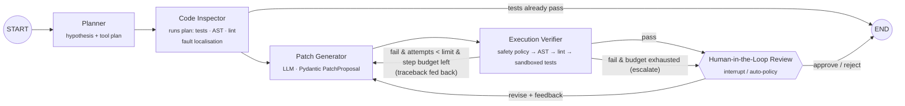
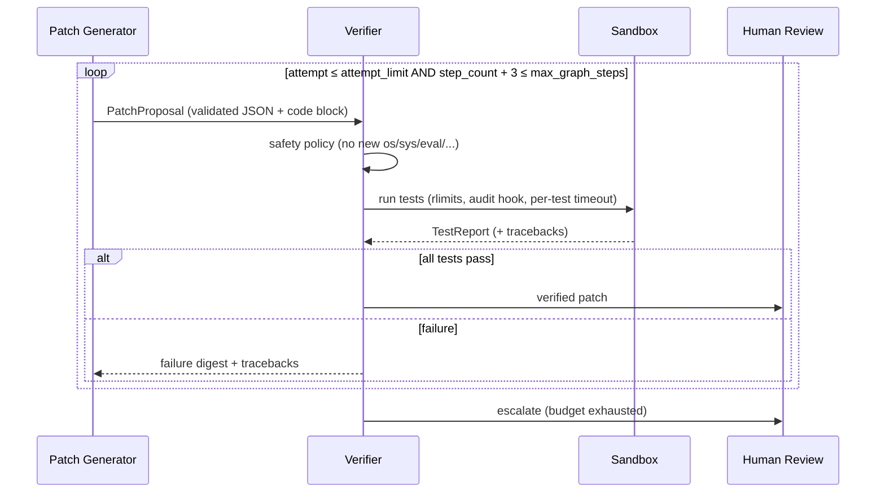

# codeverify — Autonomous Code Verification & Bug-Patching Multi-Agent System

[](https://github.com/SreenijaPavuluri/code-verify-agents/actions/workflows/ci.yml)


A LangGraph multi-agent system that takes buggy Python code plus its tests, then **plans, inspects,
patches, verifies in a sandbox, and escalates to a human** when it can't fix the bug. Failed
verifications are routed back to the Patch Generator along with their tracebacks. Every hop is
validated by Pydantic, capped by step budgets, logged as structured JSON, and served over FastAPI
with Server-Sent Events.

| Benchmark (20 buggy snippets, graded on **held-out** tests) | Result |
|---|---|
| **Pass@1**, Nemotron-3-Super-120B (free tier, T=0) | **100% (20/20)**, 0% overfit to visible tests |
| **Pass@1**, 2.6B model ablation (LFM-2.5), evaluated tasks | **100% (8/8)** vs **50%** first-attempt: the retry loop doubles resolution |
| Avg tool calls / task | 6.0 (100% tool-call success rate) |
| Latency / task (120B, free tier) | p50 11.2 s · p95 53.7 s |
| Transient provider errors absorbed (retry + fallback) | 41, with **0** task failures |
| Unbounded loops / step-budget violations | 0 / 0 |

> Full per-task reports: [`benchmarks/results/`](benchmarks/results). Methodology and caveats are
> in [Benchmark](#benchmark).

---

## Architecture



Each node is a single-responsibility function that returns a **partial state update**. Handoffs
happen through a typed `AgentState` (`TypedDict`). Artefacts are Pydantic models, and telemetry
channels (`tool_calls`, `llm_calls`, `transitions`) use append-only `operator.add` reducers, so
metrics are checkpointed along with the run and survive human-review interrupts.

| Node | Responsibility | Hands off |
|---|---|---|
| **Planner** | Forms a bug hypothesis and an ordered plan over `ast_analyze` / `lint` / `run_tests`. Uses rules by default; `CODEVERIFY_PLANNER_MODE=llm` makes it an LLM planner with a rules fallback. | `plan` |
| **Code Inspector** | Executes the plan through the tool registry and localises faults from traceback lines, AST bug patterns and fatal lint (optional LLM refinement). | `baseline_tests`, `inspection` |
| **Patch Generator** | Emits a full corrected module as a `PatchProposal`. On retries it also receives the previous patch, its tracebacks and any reviewer feedback. | `patch`, `patch_attempts` |
| **Execution Verifier** | Patch safety policy → AST syntax → Ruff lint → sandboxed tests. | `verification`, `final_code` |
| **Human Review** | Calls `langgraph.types.interrupt()` and waits for `approve` / `reject` / `revise` (API or CLI). In batch mode an auto-policy decides. | `review`, `status` |

### Routing & guardrails against infinite loops



Loops are bounded at three levels: `attempt_limit` (Patch→Verify iterations), `max_graph_steps` (a
global node budget that every router checks, always leaving room for Human Review to close the run),
and LangGraph's `recursion_limit` as a hard backstop.

### Sandbox (defence in depth)

`SubprocessSandbox` runs each test in a fresh `python -I -B -S` process inside a throw-away
directory. Protections, layer by layer:

1. **Static patch policy** ([`ast_tools.check_patch_safety`](src/codeverify/tools/ast_tools.py)) rejects
   patches that *introduce* `os`, `sys`, `subprocess`, `socket`, `inspect`, `eval`/`exec`/`open`,
   `__globals__`, and similar. The code is never executed.
2. **Process limits:** scrubbed environment, POSIX rlimits (CPU, file size, fds, and address space on
   Linux), a dedicated process group, and a hard wall-clock timeout.
3. **PEP 578 audit hook** ([`_runner.py`](src/codeverify/tools/_runner.py)) blocks sockets, process
   spawning, `ctypes`, and any write or delete outside the sandbox. Violations are recorded even when
   the code swallows the exception.
4. **Per-test `SIGALRM` timeout**, raised as a `BaseException` so `except Exception` can't
   swallow it. An infinite loop fails one test rather than hanging the run.
5. **Nonce-authenticated result channel.** Code under test can't forge a passing report by
   printing to stdout.

`DockerSandbox` runs the same runner with `--network none --read-only --cap-drop ALL --pids-limit`
(select it with `CODEVERIFY_SANDBOX=docker`).

### Structured output with a repair loop

Open models often break when code sits inside JSON strings. Every agent therefore asks for **JSON
metadata** that matches a Pydantic schema (`extra="forbid"`), and the Patch Generator puts the code
in a separate fenced ```` ```python ```` block that gets spliced into `patched_code`. When
validation fails, the exact Pydantic error is sent back to the model for up to
`max_structured_repairs` retries ([`llm/structured.py`](src/codeverify/llm/structured.py)).

### Observability

Every event is a single JSON line: `node_start/node_end` (with `latency_ms`), `tool_call` (tool, node,
success, latency), `llm_call` (model, input/output tokens, repairs), `route_retry/route_escalate`,
`guardrail_block`, `verification`, and `run_complete`. All of them carry the `run_id`. See
[`benchmarks/results/oracle-selftest_events.jsonl`](benchmarks/results/oracle-selftest_events.jsonl)
for a sample.

```json
{"ts": "2026-09-25T23:29:14.882+00:00", "level": "INFO", "msg": "tool_call", "run_id": "bd2323141a00",
 "event": "tool_call", "tool": "run_tests", "node": "inspector", "success": true, "latency_ms": 58.87}
```

---

## Project layout

```
code-verify-agents/
├── src/codeverify/
│   ├── config.py              # Settings (env-driven, frozen Pydantic model)
│   ├── schemas.py             # Pydantic v2 contracts: Plan, InspectionReport, PatchProposal, TestReport …
│   ├── state.py               # LangGraph AgentState + append-only telemetry reducers
│   ├── agents/
│   │   ├── nodes.py           # Planner, Inspector, Patch Generator, Verifier, Human Review
│   │   └── prompts.py         # system prompts + prompt builders
│   ├── graph/builder.py       # StateGraph wiring, conditional routers, step budgets, run_task()
│   ├── llm/
│   │   ├── chat_client.py     # LangChain client: retries, backoff, model fallback, request budget
│   │   ├── structured.py      # JSON extraction + Pydantic validation + repair loop
│   │   └── scripted.py        # deterministic offline LLM for tests
│   ├── tools/
│   │   ├── sandbox.py         # Subprocess / Docker sandboxes
│   │   ├── _runner.py         # in-sandbox runner: audit hook, per-test timeouts, nonce
│   │   ├── ast_tools.py       # AST analysis, bug-pattern rules, patch safety policy
│   │   ├── linter.py          # Ruff (stdin, never executes code)
│   │   └── registry.py        # instrumented tool invocation + LangChain StructuredTools
│   ├── observability/         # JSON logging, run metrics
│   ├── api/                   # FastAPI app, background run manager, SSE, webhooks, HITL
│   └── eval/                  # dataset loader, benchmark harness, CLI
├── benchmarks/
│   ├── dataset/<task_id>/     # buggy.py · test_visible.py · test_hidden.py · reference_fix.py · meta.json
│   └── results/               # JSONL results, summaries, Markdown reports
├── tests/                     # 43 offline tests (no API key needed)
├── examples/stream_client.py  # SSE client demo
├── docs/architecture.md
├── Dockerfile · docker-compose.yml · Makefile · .github/workflows/ci.yml
```

---

## Quickstart

```bash
git clone https://github.com/SreenijaPavuluri/code-verify-agents.git
cd code-verify-agents
python3.11 -m venv .venv && source .venv/bin/activate
pip install -e ".[dev]"
```

### Run the tests (offline, no API key)

```bash
make test        # ruff + 43 pytest tests (sandbox, AST, structured output, graph routing, HITL, API, eval)
```

### Run the benchmark

```bash
make validate    # checks that each bug reproduces and each reference fix passes (no LLM)
make oracle      # harness self-test using the reference fixes as the "LLM" (no API calls)

cp .env.example .env   # add OPENROUTER_API_KEY (free models work) or OPENAI_API_KEY / ANTHROPIC_API_KEY
export $(grep -v '^#' .env | xargs)
make bench       # full 20-task run → benchmarks/results/<model>_{report.md,summary.json,events.jsonl}
```

Any OpenAI-compatible endpoint works (`CODEVERIFY_PROVIDER=openai`, `CODEVERIFY_BASE_URL=...`,
covering vLLM, Ollama and similar), as does Anthropic (`CODEVERIFY_PROVIDER=anthropic`,
`pip install -e ".[anthropic]"`). `CODEVERIFY_LLM_BUDGET` caps total requests, and `--resume`
continues an interrupted run.

### Serve the API

```bash
make serve                       # http://127.0.0.1:8000/docs
python examples/stream_client.py # submits a buggy snippet and prints the live SSE stream
```

| Method | Path | Description |
|---|---|---|
| `GET` | `/health` | liveness + configured model |
| `POST` | `/v1/runs` | start a run: `{task, require_human_review?, webhook_url?}` → `202 {run_id}` |
| `GET` | `/v1/runs/{id}` | status, final patch, metrics, pending review payload |
| `GET` | `/v1/runs/{id}/events` | **SSE** stream: `run_started`, `node_update` (per node, with latency, tool calls, tokens), `review_required`, `run_completed` |
| `POST` | `/v1/runs/{id}/review` | resume a paused run: `{"decision": "approve" \| "reject" \| "revise", "feedback": "..."}` |
| `GET` | `/v1/metrics` | aggregate runs by status, tool-call success rate, tokens |

When `webhook_url` is set, the service POSTs `{run_id, event, status}` on `review_required`,
`run_completed` and `run_failed`, retrying with backoff.

```bash
docker compose up --build        # containerised API
```

---

## Benchmark

**Dataset.** 20 hand-written buggy snippets across 20 bug classes: off-by-one, boundary conditions,
mutable default arguments, late-binding closures, mutation while iterating, infinite loops, bare
`except`, syntax errors, missing preconditions, a multi-bug task, and more. Difficulty splits into
9 easy, 9 medium and 2 hard. Each task ships **visible tests** (the only tests the agent sees)
and **hidden tests** that grade Pass@1. `make validate` checks that every bug reproduces and every
reference fix passes both test sets.

**Metrics** ([`eval/harness.py`](src/codeverify/eval/harness.py)):

- **Pass@1:** one sample at T=0; the final patch must pass visible *and* hidden tests.
- **First-attempt Pass@1:** the first patch only. The difference from Pass@1 is the *self-correction lift*.
- **Overfit rate:** passes the visible tests but fails the hidden ones.
- **Tool-call success rate:** the tool ran and returned a valid structured result.
- **Plan adherence:** the share of the planner's tools that the inspector actually executed.
- **Loop convergence:** the share of repair loops that end verified, plus mean iterations to converge.
- Tokens, LLM calls, and latency (mean / p50 / p95).

### Results

| Metric | Nemotron-3-Super-120B-A12B | LFM-2.5-2.6B ablation (medium + hard) |
|---|---|---|
| Tasks evaluated | 20 / 20 | 8 / 11 ¹ |
| **Pass@1** (hidden tests) | **100%** | **100%** |
| First-attempt Pass@1 | 100% | 50% |
| Self-correction lift | +0 pp | **+50 pp** |
| Overfit rate | 0% | 0% |
| Avg tool calls | 6.0 | 5.45 |
| Tool-call success rate | 100% | 100% |
| Plan adherence | 100% | 100% |
| Structured-output repairs | 0 | 18 |
| Avg input / output tokens | 546 / 443 | 1,562 / 4,157 |
| Latency p50 / p95 | 11.2 s / 53.7 s | 18.5 s / 67.3 s |

¹ The last 3 ablation tasks never reached the model because the OpenRouter free tier's
50-requests/day cap ran out (`llm_failures: 3`). They are reported separately as infrastructure
failures, not as model failures. The strict all-tasks Pass@1 is 72.7% (8/11). Re-run them with
`--resume`.

**Takeaways**

- The strong model fixed every task on its first attempt, grounded by the Inspector's evidence
  (traceback lines, AST findings, lint). Hidden-test grading shows **0% overfitting** to the
  visible tests.
- With a 2.6B model, the **Patch→Verify loop recovered 4 of the 8 tasks that failed on the first
  attempt**. Three recovered after schema-invalid generations were rejected by Pydantic (18
  repair turns). One (`t13`, an infinite loop) recovered after the sandbox timeout's traceback was
  fed back to the Patch Generator.
- **Resilience:** during the 120B run, the client absorbed 41 transient provider errors (Nvidia
  overloads, 404s, and 429s on fallbacks). The fallback chain served 4 of the 20 tasks with
  `qwen3.8-27b`, and no task failed
  ([details](benchmarks/results/nemotron-3-super-120b_provider_errors.json)).
- **Caveats:** 20 tasks is small, and single-function bugs are easier than repository-level
  benchmarks like SWE-bench. Free-tier latency is dominated by provider queueing and retries. The
  dataset is designed so the harness can grow, since `benchmarks/dataset/` is plain files.

---

## Design notes

This project borrows only the *design pattern* of the
[multi-agent customer-support reference](https://github.com/ro-anderson/multi-agent-rag-customer-support):
a typed state graph, specialised nodes with explicit handoffs, and tools behind guarded
interrupts. The domain and code are independent. The key choices:

- **Deterministic routing over LLM routing.** Routers are pure functions of typed state (test
  results, attempt counters, budgets), so control flow is testable and can't be hijacked by
  prompt content.
- **Tools behind one instrumented registry.** Every call yields a `ToolCallRecord`. The same tools
  are exposed as LangChain `StructuredTool`s for LLM tool-calling agents.
- **LLM-cost-aware.** Planning and inspection are tool-grounded by default, and LLM planning and
  inspection are opt-in flags. The typical solve costs **one LLM call**.
- **Offline-testable.** `ScriptedLLM` makes the whole graph deterministic under test, including
  retries, safety blocks, outages, budget exhaustion and HITL resume.

## License

MIT
