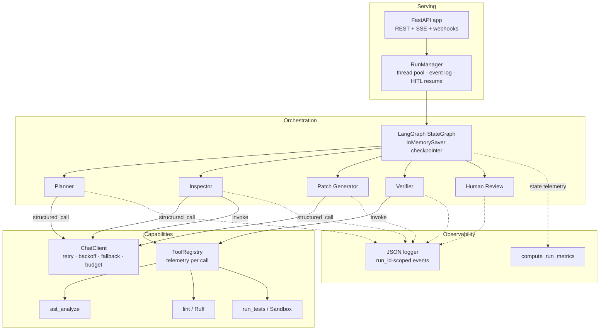

# Architecture deep-dive

## Component view

## State contract

| Channel | Type | Reducer | Written by |
|---|---|---|---|
| `task` | `BugTask` | overwrite | caller |
| `plan` | `Plan` | overwrite | Planner |
| `baseline_tests`, `ast_report`, `lint_report`, `inspection` | Pydantic reports | overwrite | Inspector |
| `patch`, `patch_attempts`, `patch_error` | `PatchProposal`, int, str | overwrite | Patch Generator |
| `patch_history` | `list[str]` | append | Patch Generator |
| `verification` / `attempt_history` | `VerificationResult` | overwrite / append | Verifier |
| `review`, `review_feedback`, `attempt_limit` | `ReviewDecision`, str, int | overwrite | Human Review |
| `status`, `termination_reason`, `final_code` | str | overwrite | Inspector / Verifier / Review |
| `tool_calls`, `llm_calls`, `transitions`, `executed_tools` | telemetry records | **append** | all nodes |
| `step_count` | int | overwrite (incremented by the `instrumented` wrapper) | all nodes |

## Routing table

| From | Condition | To |
|---|---|---|
| `inspector` | `inspection.already_passing` | `END` (status `resolved`) |
| `inspector` | otherwise | `patch_generator` |
| `verifier` | `verification.passed` | `human_review` |
| `verifier` | failed ∧ `patch_attempts < attempt_limit` ∧ `step_count + 3 ≤ max_graph_steps` | `patch_generator` (with tracebacks) |
| `verifier` | otherwise | `human_review` (escalation) |
| `human_review` | `revise` ∧ budget left | `patch_generator` (with reviewer feedback, `attempt_limit += 1`) |
| `human_review` | `approve` / `reject` | `END` |

## Failure modes handled

| Failure | Handling |
|---|---|
| LLM returns prose / invalid JSON / extra keys | Pydantic error fed back; up to `max_structured_repairs` repair turns |
| Provider 429 / overload / timeout | exponential backoff with jitter, then next model in fallback chain |
| All providers down | patch attempt marked failed; loop continues until attempt limit, then escalates |
| Request budget exhausted | `BudgetExceeded` → same graceful path; harness reports it as `llm_failure` |
| Patch imports `os`/`sys`/uses `eval` | blocked by static policy before execution; reason fed back |
| Infinite loop in patch | per-test `SIGALRM` + hard subprocess timeout |
| Patch touches network / filesystem / spawns | audit hook denies and records violation → verification fails |
| Patch prints fake "all passed" JSON | ignored — only the nonce-prefixed line is trusted |
| Planner LLM emits an invalid plan | schema validator rejects (e.g. no `run_tests`) → rules fallback |
